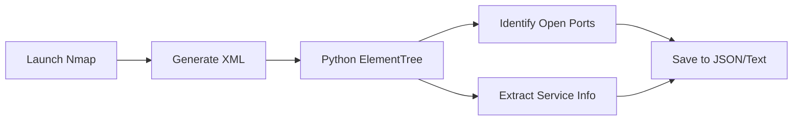

# Beginner's Guide to Linux & Python Basics (csehot)

Welcome to the `csehot` (Computer Security & Ethical Hacking On-host Tools) lab environment! This guide is designed to help you understand the core Linux and Python concepts used in this repository.

---

<details>
<summary><b>1. Python <code>subprocess</code> Mastery</b></summary>

Throughout the labs, we use Python to automate terminal commands. The `subprocess` module is our primary tool for this.

### `shell=True` vs `shell=False`
In our `cli.py` and `network_scan.py` scripts, you'll see `subprocess.run(cmd, shell=True)`.

*   **`shell=True`**: This tells Python to run the command through the actual shell (like `/bin/sh`).
    *   *Pros*: You can use shell-specific features like pipes (`|`), redirects (`>`), and wildcards (`*`) directly in your command string.
    *   *Cons*: **Security Risk!** If user input is directly included in the command string, an attacker could "escape" the command and run arbitrary code (Command Injection).
*   **`shell=False` (The Secure Default)**: This runs the executable directly without a shell.
    *   *Pros*: Much safer because arguments are passed as a list, preventing command injection.
    *   *Cons*: You cannot use `|`, `>`, or `&` directly in the command list.

**Example from `cli.py`:**
```python
# We use shell=True here to allow complex user commands with pipes/redirects
subprocess.run(cmd, shell=True, capture_output=True, text=True)
```

### Capturing Output & Timeouts
*   **`capture_output=True`**: Saves the results (stdout and stderr) so we can log them or process them later.
*   **`text=True`**: Returns the output as a string instead of raw bytes.
*   **`timeout=120`**: Prevents a command from hanging forever if something goes wrong.

</details>

<details>
<summary><b>2. Terminal & Shell Power User Basics</b></summary>

The terminal is where the magic happens. Here are the most common elements you'll see:

### Redirection and Backgrounding
*   **`&` (Backgrounding)**: Runs a command in the background, allowing you to keep using the terminal.
    *   *Example*: `python listener.py &` starts the listener but gives you your prompt back immediately.
*   **`>` (Overwrite)**: Saves output to a file, replacing any existing content.
*   **`>>` (Append)**: Adds output to the end of an existing file.
*   **`2>&1` (Combine Errors)**: Tells the shell to send "Standard Error" (2) to the same place as "Standard Output" (1). 
    *   *Example*: `nikto -h target 2>&1 | tee scan.log` captures everything.

### Chaining and Piping
*   **`|` (Pipe)**: Takes the output of the left command and feeds it as input to the right command.
    *   *Logic*: `Command A ➔ [Pipe] ➔ Command B`
*   **`&&` (AND)**: Run the second command *only if* the first one succeeds.
*   **`||` (OR)**: Run the second command *only if* the first one fails.
*   **`;` (Sequential)**: Run the second command regardless of what happens to the first.

### Shell Flags: `set -e`
In `setup.sh`, you'll see `set -e`. This is a "safety first" flag that tells the script to **exit immediately** if any command fails. This prevents a broken installation from continuing and causing more issues.

</details>

<details>
<summary><b>3. Colors in the Terminal (ANSI Escapes)</b></summary>

Ever wonder how `cli.py` prints text in RED or GREEN? We use **ANSI Escape Codes**.

```python
RED = "\033[0;31m"
GREEN = "\033[0;32m"
NC = "\033[0m" # No Color (Reset)
```
When the terminal sees `\033`, it knows a formatting instruction is coming. `[0;31m` tells it to start printing in red, and `[0m` tells it to stop.

### Usage
```bash
echo -e "${RED}This is red text${NC}"
echo -e "${GREEN}This is green text${NC}"
echo -e "${NC}" # Resets the color
```

</details>

<details>
<summary><b>4. Nmap Parsing Logic (XML Extraction)</b></summary>

In `scripts/network_scan.py`, we don't just "read" the text `nmap` prints. Instead, we ask for **XML output** using `-oX -`.

### Why Parse XML?
Structured data (XML/JSON) is much more reliable than plain text. If `nmap` changes its display format, our script would break if it used regular text, but XML remains consistent.

### Visual Workflow:


### Python's `ElementTree`
We use `xml.etree.ElementTree` to navigate the XML "tree". We look for tags like `<host>`, `<port>`, and `<service>` to find exactly what we need without guessing.

</details>

<details>
<summary><b>5. Linux Environment Essentials</b></summary>

### The Shebang (`#!`)
The first line of our scripts (e.g., `#!/usr/bin/env python3`) tells the OS which interpreter to use. This allows you to run `./cli.py` instead of `python3 cli.py`.

### Permissions (`chmod +x`)
Linux files are not executable by default. `chmod +x script.sh` gives the file "eXecute" permissions so it can be run as a program.

### Path Management (`os.path`)
Our scripts use `os.path.join` and `os.path.abspath(__file__)` to ensure they always know where the `labs/` or `logs/` folders are, no matter where you currently are in the terminal.

</details>

---

*Found a bug or have a question? View the [README.md](./README.md) for more info.*
